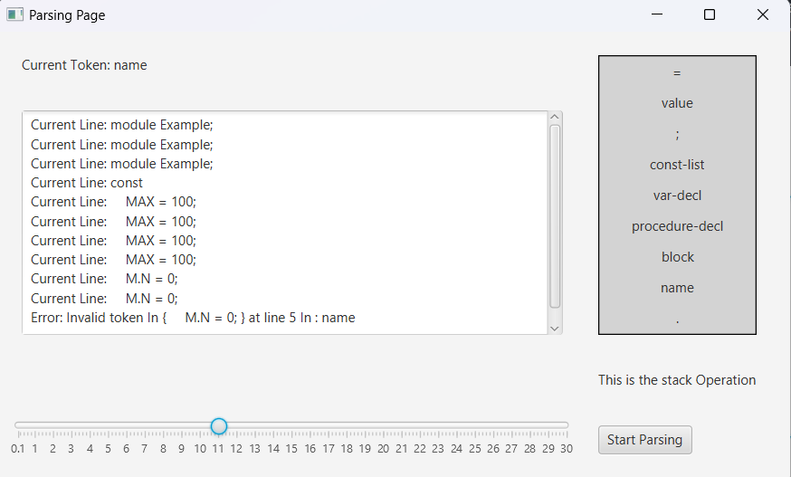

# LL1-Parser

LL1 parser is top-down parser that use table to parse the source code and check if there any errors in it.

In this project we build a dynamic LL1 parser, that hold the production rules(you can configure them), and calculate the first and follow for each non-terminal, then use them to build the parsing table.

then you can put the source that follow the production rules, and check if contain errors or not.

# Start 

This project has built usinf Java 17 and Javafx for UI. so make sure they installed on your device. 

## how to run 

there is a folder could **lib** inside **project** dicrectory, those are Javafx jar files that you need to include first, 

so you can run the app .

then go to **App.java** class and run the app. 

## how to use

when the start you will see this screen : 

this is the main screen, contains basic introduction about LL1 parser, and button that open the basic components that LL1 used to parse your source code: 

* production rules: the main sources for the LL1:
  and you can see all the production rules, and you can search for specific one if you want.
* Firsts & Follow Set: those are the fisrts and follows set for all non-terminal in the rules:
* then the prasing table: that containt the instruction that the parser will follow to parse the code(its like mapping between the current token and the token in the top of stack to get the rule that we need to check for current token) :
* choose file: to use the parser, you need to provide  a source code(the repo contain two files  in **project/src** dicrectory called **testfile_contain_error.text**  and **testfile_without_error.text**  you can use) after choose the correct file with filechooser, you will see this :
  this window, provide a simple slidation to see how the process gone. you set the speed of slidation with that bar, then hit the start paring button to start the process.
  the Text area will display the current line that been checked, and title Parsing Page will display the current token, and Stach operation will show how stack push and pop the rules and tokens.
  afet hit start and finish :
  you will see massege that said error, or successfull depend on the code that you provide.

# Thanks 

> All the thanks gone for Allah firts and then for the Doctor Ali Jaber how teached us.
>
> Then to myself for all that hard work ✌️❤️

###### **Please Give me A Star 😁**
